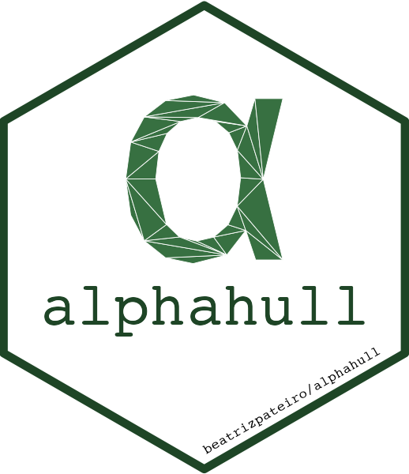

<!-- README.md is generated from README.Rmd. Please edit that file -->
<br>
<h2>
alphahull
</h2>

**Maintainer:** Beatriz Pateiro-Lopez

------------------------------------------------------------------------

Computation of the alpha-shape and alpha-convex hull of a given sample
of points in the plane. The concepts of alpha-shape and alpha-convex
hull generalize the definition of the convex hull of a finite set of
points. The programming is based on the duality between the Voronoi
diagram and Delaunay triangulation. The package also includes a function
that returns the Delaunay mesh of a given sample of points and its dual
Voronoi diagram in one single object.

``` r
# Install the development version of this package:
library(remotes)
install_github("atlasoflivingaustralia/alphahull@ala-dev")

# Load package
library(alphahull)
```
